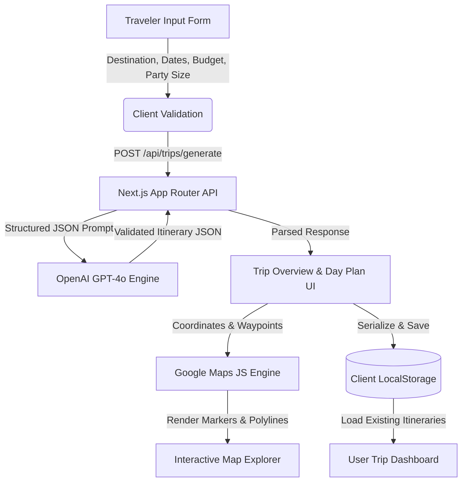

<div align="center">

# 🌍 Vagabond AI — Next-Gen AI Travel Planner & Routing Engine

**Craft personalized, day-by-day travel itineraries in seconds with autonomous AI curation and live interactive map routing.**

[](https://nextjs.org/)
[](https://www.typescriptlang.org/)
[](https://tailwindcss.com/)
[](https://openai.com/)
[](https://developers.google.com/maps)
[](./LICENSE)
[](https://github.com/DevbratPatel)

<br />

[Explore Features](#-features) • [Tech Stack](#-technology-stack) • [Quickstart](#-quickstart-guide) • [Architecture](#-architecture) • [Environment Variables](#-environment-variables) • [Contributing](#-contributing)

</div>

---

## ✨ Overview

**Vagabond AI** is an intelligent, privacy-first travel planning platform engineered to transform spontaneous wanderlust into meticulously organized, day-by-day itineraries. 

By combining the reasoning power of **OpenAI's GPT-4o** with precision geocoding from the **Google Maps JavaScript & Places API**, Vagabond AI generates hyper-customized trip plans featuring optimal route sequencing, real-world dining spots, curated activities, and budget-tailored suggestions.

### 🌟 Why Vagabond AI Stands Out
- **Zero-Barrier Friction**: No sign-ups, no passwords, and no verification walls. Start planning your dream getaway in under 10 seconds.
- **Privacy by Architecture**: All trips are stored directly inside the client's browser using `localStorage`. No user surveillance, no central database vulnerability, and near-zero server infrastructure costs.
- **Dynamic Visuals & 3D Elements**: Sleek, glassmorphic UI elevated with Three.js canvas particle animations and smooth Framer Motion transitions.

---

## 🚀 Features

| Feature | Description |
| :--- | :--- |
| 🤖 **Autonomous AI Itinerary Generation** | Uses structured JSON outputs from OpenAI to formulate chronologically consistent daily schedules, themed days, and estimated costs. |
| 🗺️ **Interactive Multi-Day Map Routing** | Visualizes daily waypoints directly onto an interactive Google Map with custom pin markers, info windows, and polyline travel trails. |
| 📍 **Google Places Autocomplete** | Instant global city and country resolution with real-time autocompletion. |
| 🍽️ **Smart Culinary & Landmark Recommendations** | Delivers accurate coordinates and curated picks for breakfast, lunch, and dinner, complete with direct Google Maps external links. |
| 💼 **Personal Dashboard & Offline Persistence** | Save multiple trips locally, reload them on demand, inspect detailed timelines, or delete old journeys without losing performance. |
| 🎨 **Cinematic Glassmorphism UI** | Designed with high-contrast typography, tailored dark/light palettes, and animated background particles. |

---

## 🛠️ Technology Stack

| Layer | Technologies | Details |
| :--- | :--- | :--- |
| **Frontend Framework** | [Next.js 14](https://nextjs.org/) (App Router) | Server Components, Client Transitions, Fast Refresh |
| **Language** | [TypeScript](https://www.typescriptlang.org/) | Type-safe models for itineraries, activities, and coordinates |
| **Styling** | [Tailwind CSS](https://tailwindcss.com/) | Custom design tokens, glassmorphism, responsive grid layouts |
| **3D & Animation** | [Three.js](https://threejs.org/) & [Framer Motion](https://www.framer.com/motion/) | Smooth canvas particle effects and micro-interactions |
| **AI Intelligence** | [OpenAI SDK](https://github.com/openai/openai-node) | GPT-4o-mini with enforced structured JSON schema |
| **Mapping Engine** | [@react-google-maps/api](https://www.npmjs.com/package/@react-google-maps/api) | Dynamic marker clusters, polylines, and Places API |
| **Client Storage** | Web Storage API (`localStorage`) | Secure, client-side zero-latency data persistence |

---

## 🏗️ Architecture



---

## 🏁 Quickstart Guide

### 1. Prerequisites
- **Node.js**: `v18.x` or later
- **npm** or **yarn** / **pnpm**
- An active **OpenAI API Key**
- A **Google Cloud Console** account with Maps JavaScript API & Places API enabled

### 2. Clone the Repository
```bash
git clone https://github.com/DevbratPatel/vagabond-ai.git
cd vagabond-ai
```

### 3. Install Dependencies
```bash
npm install
```

### 4. Configure Environment Variables
Create a `.env.local` file in the root directory:
```bash
cp .env.example .env.local
```

Populate the keys in `.env.local`:
```env
# OpenAI Secret Key (Required)
OPENAI_API_KEY=sk-proj-xxxxxxxxxxxxxxxxxxxxxxxx

# Google Maps Public Key (Required)
NEXT_PUBLIC_GOOGLE_MAPS_API_KEY=AIzaSyxxxxxxxxxxxxxxxxxxxxxxxx

# Optional: Custom OpenAI Base URL (e.g. OpenRouter or Proxies)
# OPENAI_API_BASE_URL=https://openrouter.ai/api/v1
```

### 5. Launch the Development Server
```bash
npm run dev
```

Open [http://localhost:3000](http://localhost:3000) in your browser.

### 6. Build for Production
```bash
npm run build
npm run start
```

---

## ⚙️ Environment Variables

| Variable | Scope | Required | Description |
| :--- | :---: | :---: | :--- |
| `OPENAI_API_KEY` | Server | **Yes** | OpenAI API key for generating smart travel schedules |
| `NEXT_PUBLIC_GOOGLE_MAPS_API_KEY` | Client | **Yes** | Google Cloud API key for Maps SDK & Places Autocomplete |
| `OPENAI_API_BASE_URL` | Server | *Optional* | Alternative endpoint URL for OpenAI-compatible proxies |

---

## 📂 Project Structure

```
vagabond-ai/
├── src/
│   ├── app/
│   │   ├── api/
│   │   │   └── trips/
│   │   │       └── generate/      # OpenAI prompt & JSON generation route
│   │   ├── plan/                  # Step-by-step trip builder interface
│   │   ├── trips/                 # Saved itineraries dashboard
│   │   │   └── [id]/              # Detailed day-by-day view & interactive map
│   │   ├── globals.css            # Custom design tokens, glass utilities
│   │   ├── layout.tsx             # Root layout with navbar & animated backdrop
│   │   └── page.tsx               # High-converting landing page
│   ├── components/
│   │   ├── 3d/                    # Canvas particle backgrounds & 3D journey effects
│   │   ├── DashboardTripCard.tsx  # Saved itinerary management & cards
│   │   ├── DestinationInput.tsx   # Google Places search & autocompletion
│   │   ├── InteractiveGlobe.tsx   # 3D interactive spinning globe
│   │   ├── Navbar.tsx             # Responsive glassmorphic navigation
│   │   ├── TripDetailsContainer.tsx# Daily schedule viewer & activity cards
│   │   └── TripMap.tsx            # Google Maps container, markers & polylines
│   └── lib/
│       ├── openai.ts              # OpenAI client configuration
│       └── utils.ts               # Formatting, date helpers, coordinate maths
├── public/                        # Static assets, icons, and illustrations
├── .env.example                   # Environment configuration template
├── DEPLOYMENT.md                  # Comprehensive Vercel deployment walkthrough
├── LICENSE                        # MIT License
└── package.json                   # Project metadata and dependencies
```

---

## 🚢 Deployment (Vercel)

The application is pre-configured for seamless zero-config deployment on [Vercel](https://vercel.com):

1. Fork or push this repository to your GitHub account: `https://github.com/DevbratPatel/vagabond-ai`.
2. Connect your repository on the [Vercel Dashboard](https://vercel.com/new).
3. Under **Environment Variables**, add:
   - `OPENAI_API_KEY`
   - `NEXT_PUBLIC_GOOGLE_MAPS_API_KEY`
4. Click **Deploy**.

For detailed custom domain configuration (`vagabond.ai`), refer to [DEPLOYMENT.md](./DEPLOYMENT.md).

---

## 🤝 Contributing

Contributions, issues, and feature requests are welcome! Feel free to check the [issues page](https://github.com/DevbratPatel/vagabond-ai/issues).

1. Fork the Project (`gh repo fork DevbratPatel/vagabond-ai`)
2. Create your Feature Branch (`git checkout -b feature/AmazingFeature`)
3. Commit your Changes (`git commit -m 'Add some AmazingFeature'`)
4. Push to the Branch (`git push origin feature/AmazingFeature`)
5. Open a Pull Request

---

## 📜 License

Copyright (c) 2026 **Devbrat Patel**. All rights reserved. See [`LICENSE`](./LICENSE) for full proprietary terms.

---

## 👤 Author

**Devbrat Patel**
- GitHub: [@DevbratPatel](https://github.com/DevbratPatel)

---

<div align="center">
  <sub>Built with ❤️ by <a href="https://github.com/DevbratPatel">Devbrat Patel</a>. If you found this project helpful, please give it a ⭐️!</sub>
</div>
